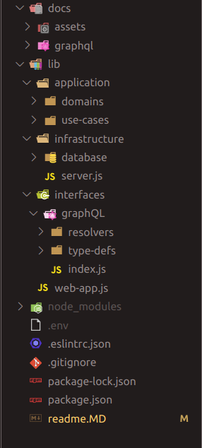

<h1>UaiFood</h1>

<h2>Descrição</h2>
<p>Esta é a API do <s>inovador</s> app UaiFood, uma plataforma de delivery para a região de Minas Gerais. Confere aí que o trem tá massa!</p>

<h2>Principais tecnologias</h2>
<ul>
  <li>NodeJS</li>
  <li>GraphQL</li>
  <li>Apollo Server | Express</li>
  <li>MongoDB</li>
</ul>

<h2>Padrão arquitetural</h2>
<p>Por ser um projeto pequeno, optei pela clean architecture do uncle Bob ao invés de outras arquiteturas que tariam complexidades desnecessárias como a Hexagonal Architecture.</p>

<p>Estrutura atual: </p>


<h2>Patterns utilizados</h2>
<ul>
  <li>Factory Pattern</li>
  <li>Dependency Injection</li>
</ul>

<h2 style="margin-top: 20px">Execução do projeto</h2>

```sh
# Clonando o projeto e entrando no diretório
$ git clone https://github.com/eduardodiasm/uai-food.git
$ cd uai-food

# Instalação das dependências
$ npm i

# Configuração do ambiente
$ touch .env
$ echo "MONGO_URI = <uri>" > .env
# Substitua "<uri>" pela URI de seu banco de dados Mongo.

# Execução do servidor
$ npm run dev
```

<h2 style="margin-top: 20px">Acesso a API</h2>
<p>Seguindo os passos anteriores para execução do projeto, você poderá agora acessar a API de duas formas: através da URL <i>http://localhost:3333</i> via algum API client de sua preferência (Insomnia, Postman, etc.) ou via playground no seu browser também pela mesma URL. <p>

<h3>Exemplo de mutation executada via Playground</h3>


<h2 style="margin-top: 20px">Documentação de todos  endpoints da API</h2>

