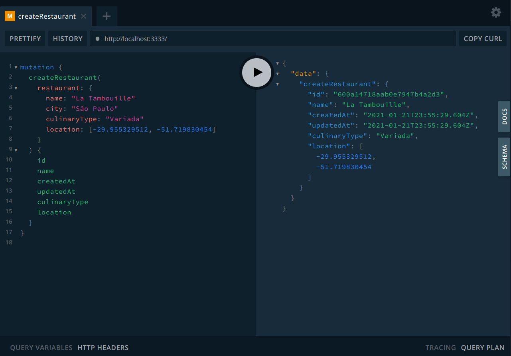
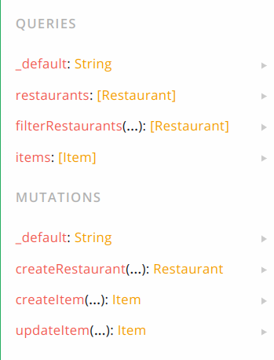

<h1>UAIFood</h1>

<h2>Execução do projeto</h2>

```sh
# Clonando o projeto e entrando no diretório
$ git clone https://github.com/eduardodiasm/uai-food.git
$ cd uai-food

# Instalação das dependências
$ npm i

# Configuração do ambiente
$ touch .env
$ echo "MONGO_URI = <uri>" > .env
# Substitua "<uri>" pela URI de seu banco de dados Mongo.

# Execução do servidor
$ npm run dev
```

<h2>Acesso a API</h2>
<p>Seguindo os passos anteriores para execução do projeto, agora você pode acessar a API de duas formas no endpoint <i>http://localhost:3333</i>, via algum API Client de sua preferência (Insomnia, Postman, etc.) ou via playground no seu browser. <p>

<h3>Exemplo de mutation executada via Playground</h3>


<h2 style="margin-top: 20px">Documentação dos endpoints da API</h2>
